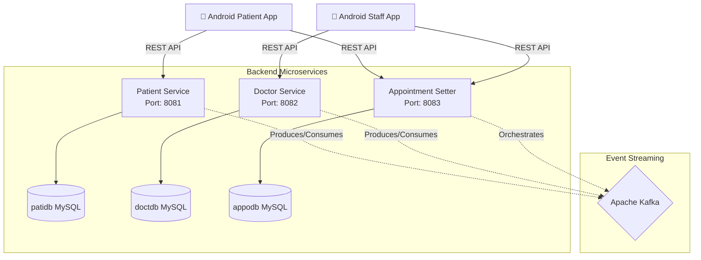

<h1 align="center">
  🏥 St. Lukas Healthcare Management System
</h1>

   
   
   
   
   

A comprehensive, microservices-based healthcare management system designed to streamline the interaction between patients and medical staff. The system handles patient records, doctor availability, and complex appointment scheduling through asynchronous, event-driven communication.

## 🚀 Key Achievements & Features

- **Microservices Architecture**: Designed and deployed 3 distinct Spring Boot microservices (Patient, Doctor, Appointment Setter) to ensure clean separation of concerns and independent scalability.
- **Event-Driven Communication**: Integrated **Apache Kafka** to handle asynchronous messaging between services, ensuring that the Appointment Setter service can orchestrate workflows reliably without synchronous blocking.
- **Containerized Infrastructure**: Created a robust `docker-compose.yml` to orchestrate the entire backend environment (MySQL, Kafka, and 3 custom services), allowing for one-click cross-platform deployment.
- **Dedicated Mobile Clients**: Built two native Android applications (`PatientApp` and `StaffApp`) using Kotlin, providing tailored UX/UI experiences for different user roles within the hospital ecosystem.

## 📐 System Architecture

The ecosystem relies on an API-driven microservices backend that communicates with front-end mobile clients.

## 🛠 Tech Stack

**Backend:**
- **Java 17 & Spring Boot 3**: Core backend framework for building RESTful microservices.
- **Spring Data JPA & Hibernate**: For ORM and database interactions.
- **Apache Kafka**: Inter-service message broker.
- **MySQL 8.0**: Relational database (1 dedicated schema per microservice).

**Frontend:**
- **Kotlin & Android SDK**: Native mobile application development (`PatientApp` and `StaffApp`).
- **Retrofit / OkHttp**: Networking libraries for API consumption.

**DevOps & Deployment:**
- **Docker & Docker Compose**: Containerization and local orchestration.
- **Maven**: Dependency management and build automation.
